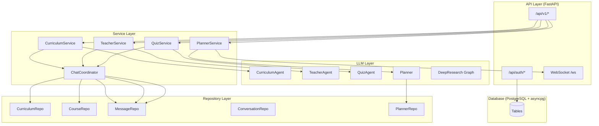
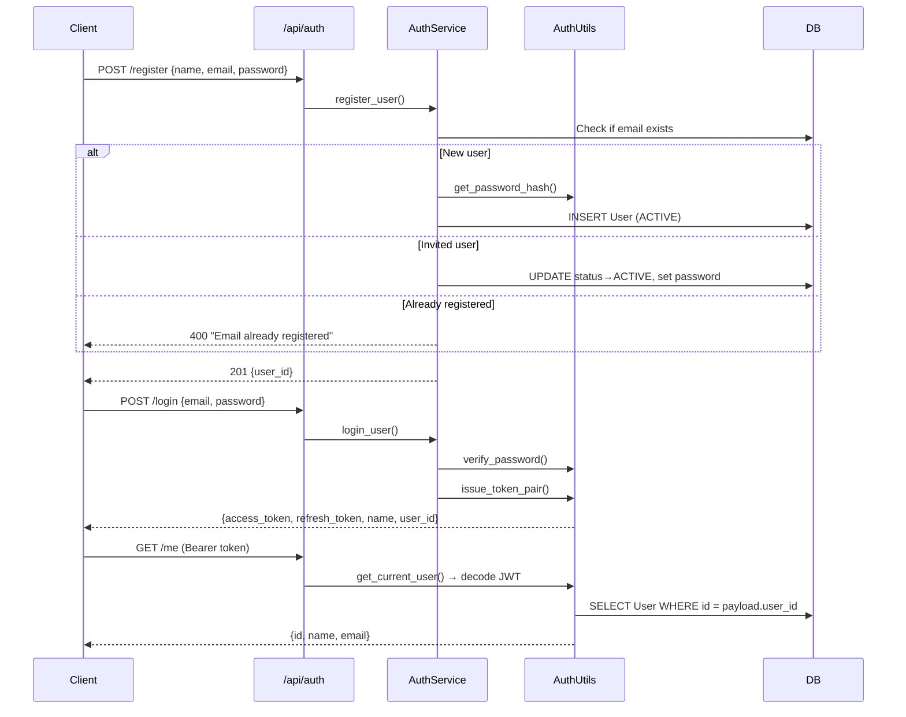
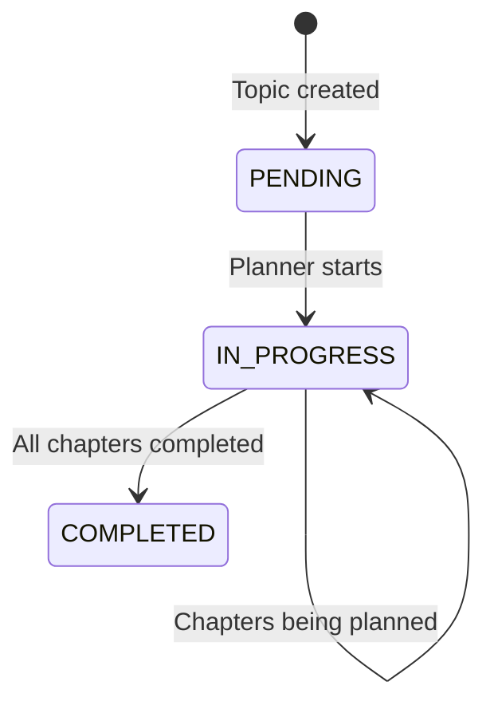
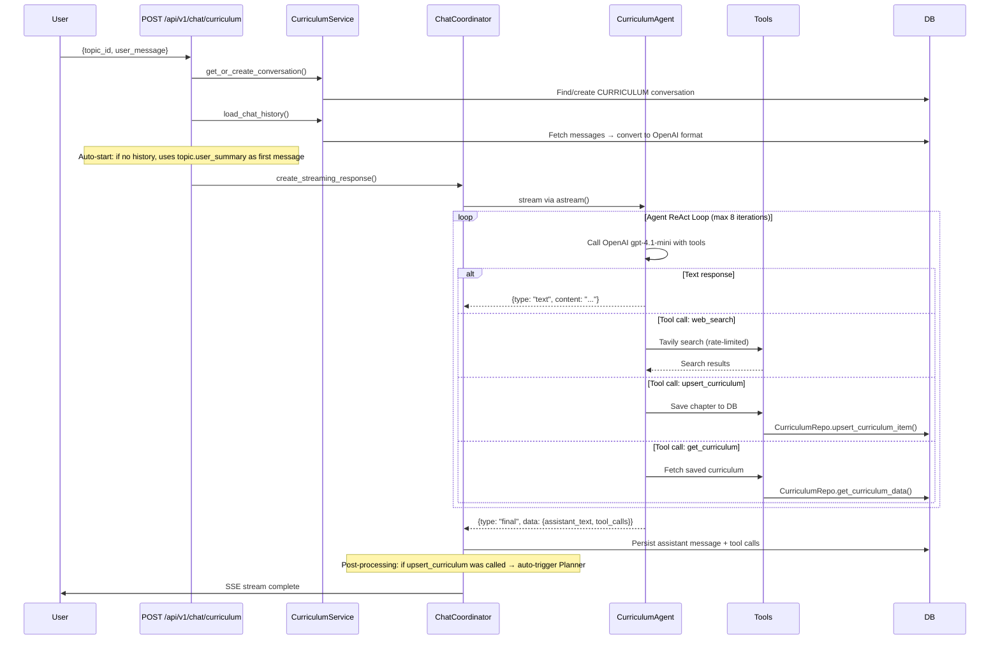
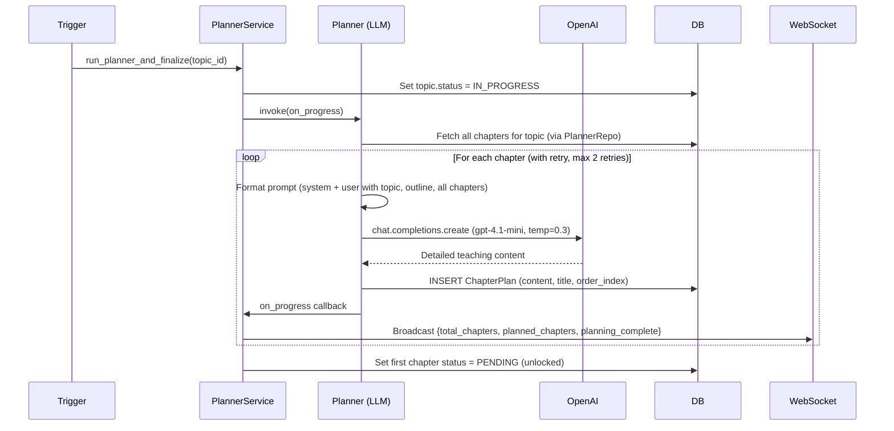
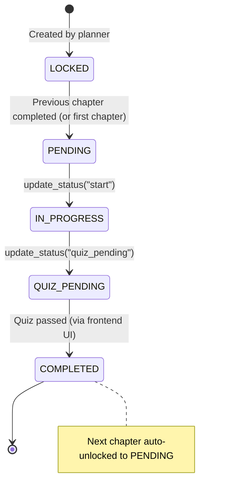
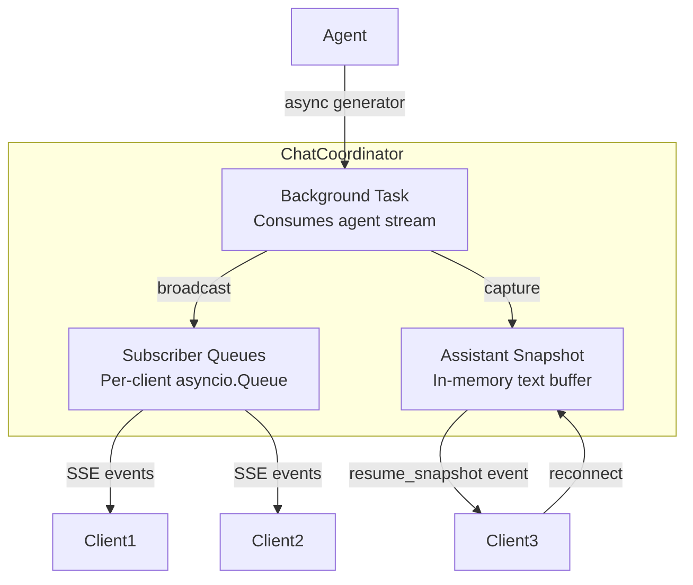
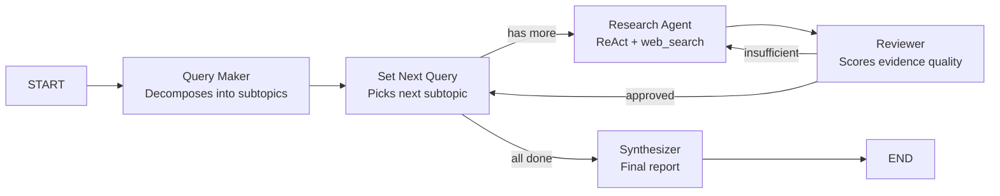
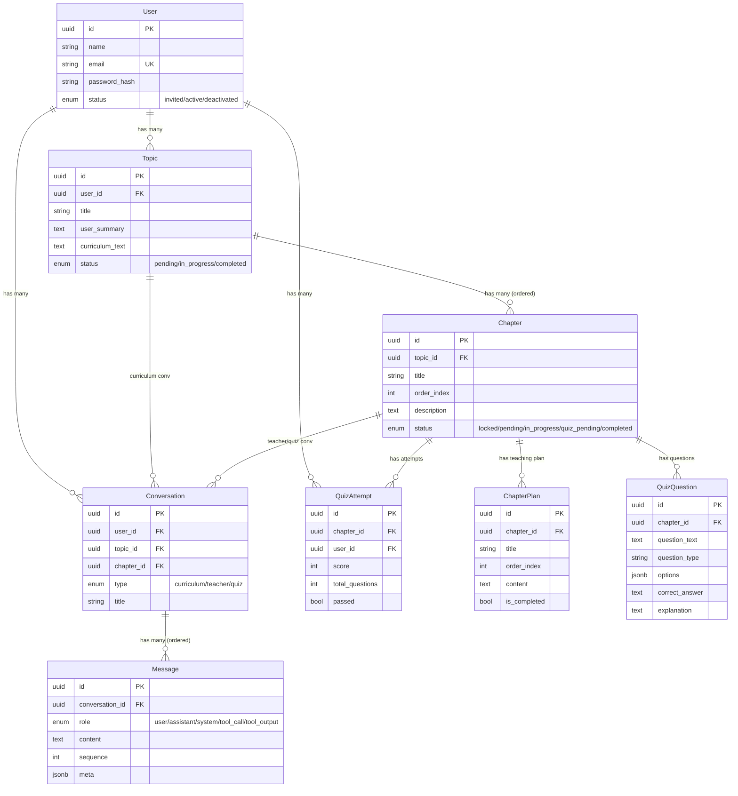

# AI Tutor — Comprehensive Feature Report

> **Scope**: Every file inside `/Users/rudraksh/AI_Tutor/src/` (backend + LLM modules).
> **Generated**: 2026-04-16 based on live source code analysis.

---

## Table of Contents

1. [Architecture Overview](#1-architecture-overview)
2. [Feature 1 — Authentication & User Management](#2-feature-1--authentication--user-management)
3. [Feature 2 — Topic & Sidebar Management](#3-feature-2--topic--sidebar-management)
4. [Feature 3 — Curriculum Negotiation (Curriculum Agent)](#4-feature-3--curriculum-negotiation-curriculum-agent)
5. [Feature 4 — Automated Chapter Planning (Planner)](#5-feature-4--automated-chapter-planning-planner)
6. [Feature 5 — Teacher-Led Instruction (Teacher Agent)](#6-feature-5--teacher-led-instruction-teacher-agent)
7. [Feature 6 — Quiz Assessment (Quiz Agent)](#7-feature-6--quiz-assessment-quiz-agent)
8. [Feature 7 — Chat Coordinator & SSE Streaming](#8-feature-7--chat-coordinator--sse-streaming)
9. [Feature 8 — Conversation & Message Persistence](#9-feature-8--conversation--message-persistence)
10. [Feature 9 — Real-Time WebSocket Notifications](#10-feature-9--real-time-websocket-notifications)
11. [Feature 10 — Deep Research Pipeline (LangGraph)](#11-feature-10--deep-research-pipeline-langgraph)
12. [Feature 11 — Query Expansion](#12-feature-11--query-expansion)
13. [Cross-Cutting Concerns](#13-cross-cutting-concerns)
14. [Data Model Diagram](#14-data-model-diagram)
15. [Complete Learning Flow — End-to-End](#15-complete-learning-flow--end-to-end)

---

## 1. Architecture Overview

The application follows a **layered architecture** with clean separation of concerns:



| Layer         | Technology                               | Key Pattern                               |
| ------------- | ---------------------------------------- | ----------------------------------------- |
| API           | FastAPI + Uvicorn                        | Async endpoints, SSE streaming, WebSocket |
| Auth          | JWT (HS256) via `python-jose` + `bcrypt` | Access + Refresh token pair               |
| ORM           | SQLAlchemy 2.0 (async)                   | `asyncpg` driver, `declarative_base`      |
| LLM           | OpenAI `gpt-4.1-mini`                    | Custom `Agent` framework with streaming   |
| Search        | Tavily API                               | Rate-limited web search                   |
| Deep Research | LangGraph `StateGraph`                   | Multi-agent graph with reviewer loop      |

---

## 2. Feature 1 — Authentication & User Management

### What It Does

Handles user registration, login, JWT token management, and session identity.

### Request Flow



### Files Involved

| File                                                                            | Role                                                               |
| ------------------------------------------------------------------------------- | ------------------------------------------------------------------ |
| [routes.py](file:///Users/rudraksh/AI_Tutor/src/backend/api/auth/routes.py)     | 4 endpoints: `/register`, `/login`, `/me`, `/refresh`              |
| [services.py](file:///Users/rudraksh/AI_Tutor/src/backend/api/auth/services.py) | Business logic: register, login, refresh token                     |
| [utils.py](file:///Users/rudraksh/AI_Tutor/src/backend/api/auth/utils.py)       | `bcrypt` hashing, JWT encode/decode, `get_current_user` dependency |
| [schemas.py](file:///Users/rudraksh/AI_Tutor/src/backend/api/auth/schemas.py)   | Pydantic: `UserCreate`, `UserLogin`, `Token`, `UserRead`           |
| [user.py](file:///Users/rudraksh/AI_Tutor/src/backend/models/user.py)           | `User` model with `UserStatus` enum (INVITED/ACTIVE/DEACTIVATED)   |

### Key Design Decisions

- **Password validation**: Enforced at schema level — min 6 chars, requires uppercase, lowercase, digit, special char.
- **Invited user pattern**: Users can be pre-created with `INVITED` status (no password). Registration completes their account.
- **Dual token system**: Access tokens expire in 30 min, refresh tokens in 7 days.
- **Soft-delete aware**: `get_current_user` filters by `deleted_at IS NULL`.

---

## 3. Feature 2 — Topic & Sidebar Management

### What It Does

Manages learning topics (subjects the user wants to learn), provides sidebar data grouped by status, and exposes chapter listings per topic.

### Endpoints

| Method | Path                            | Purpose                                      |
| ------ | ------------------------------- | -------------------------------------------- |
| `POST` | `/api/v1/topics/`               | Create topic (explicit `user_id`)            |
| `POST` | `/api/v1/topics/start`          | Create topic (user from JWT)                 |
| `GET`  | `/api/v1/topics/{id}`           | Fetch single topic with chapters             |
| `GET`  | `/api/v1/topics/{id}/chapters`  | List chapters for a topic                    |
| `GET`  | `/api/v1/topics/{id}/status`    | Poll planning progress                       |
| `WS`   | `/api/v1/topics/{id}/status/ws` | WebSocket for live planning status           |
| `GET`  | `/api/v1/sidebar/`              | Sidebar data: in_progress + completed topics |

### How the Sidebar Works

```python
# sidebar.py — groups topics by status
for t in topics:
    if t.status == TopicStatus.COMPLETED:
        completed.append(item)
    else:  # PENDING and IN_PROGRESS → incomplete bucket
        in_progress.append(item)
```

The sidebar returns a `SidebarResponse` with two arrays: `in_progress` and `completed`, each containing `SidebarTopicItem` objects.

### Status State Machine



---

## 4. Feature 3 — Curriculum Negotiation (Curriculum Agent)

### What It Does

An AI-powered conversational agent that **designs a personalized curriculum** through natural dialogue. It collects the learner's goals, knowledge level, and learning style, then produces a structured multi-chapter curriculum.

### End-to-End Flow



### Agent Architecture

The `CurriculumAgent` extends the base `Agent` class:

| Component                | File                                                                                                        | Details                                                                            |
| ------------------------ | ----------------------------------------------------------------------------------------------------------- | ---------------------------------------------------------------------------------- |
| Agent class              | [agent.py](file:///Users/rudraksh/AI_Tutor/src/llm/curriculum_agent/agent.py)                               | Tracks `saved_chapters` set, fails after 2 consecutive save errors                 |
| System prompt            | [prompt.py](file:///Users/rudraksh/AI_Tutor/src/llm/curriculum_agent/prompt.py)                             | Expert curriculum designer. Collects info → web search → generate → confirm → save |
| `web_search` tool        | [web_search.py](file:///Users/rudraksh/AI_Tutor/src/llm/curriculum_agent/tools/web_search.py)               | Tavily API, max 5 calls/second rate limit                                          |
| `upsert_curriculum` tool | [upsert_curriculum.py](file:///Users/rudraksh/AI_Tutor/src/llm/curriculum_agent/tools/upsert_curriculum.py) | Saves one chapter per tool call via `CurriculumRepo`                               |
| `get_curriculum` tool    | [get_curriculum.py](file:///Users/rudraksh/AI_Tutor/src/llm/curriculum_agent/tools/get_curriculum.py)       | Reads existing curriculum for modification                                         |

### Key Behavioral Rules (from prompt)

1. Asks **ONE question at a time** to collect learning goals, topic, knowledge level, and style.
2. **Web search is MANDATORY** before generating curriculum (fetches current academic standards).
3. Outputs the complete curriculum wrapped in `<curriculum>` tags.
4. Saves chapter-by-chapter using individual `upsert_curriculum` tool calls.
5. After save, **automatically triggers the Planner** as a background task.

---

## 5. Feature 4 — Automated Chapter Planning (Planner)

### What It Does

Takes the high-level chapter outlines from the curriculum and generates **detailed, teacher-ready instructional content** for each chapter. This runs as a background task — no user interaction required.

### How It's Triggered

1. **Auto-trigger**: After curriculum save in `chat_curriculum.py`, `_curriculum_post_process` calls `PlannerService.run_planner_and_finalize()`.
2. **Manual trigger**: `POST /api/v1/chat/curriculum/{topic_id}/plan` endpoint.
3. **Recovery**: On server startup, `PlannerService.recover_stalled_tasks()` finds topics stuck in `IN_PROGRESS` and restarts their planners.

### Planning Flow



### Planner Prompt Design

The [planner prompt](file:///Users/rudraksh/AI_Tutor/src/llm/planner/prompt.py) instructs the LLM to act as a **textbook author**:

- Write complete instructional content (not just outlines)
- Organize like a textbook: numbered sections, sub-sections
- **Curriculum-aware**: avoids repeating past chapters or previewing future ones
- No exercises/quizzes — pure teaching content
- Content must be "detailed enough to be taught verbatim"

### Files Involved

| File                                                                                          | Role                                                                                     |
| --------------------------------------------------------------------------------------------- | ---------------------------------------------------------------------------------------- |
| [chapter_planner.py](file:///Users/rudraksh/AI_Tutor/src/llm/planner/chapter_planner.py)      | Core logic: fetches chapters, generates content, saves with retries                      |
| [planner_service.py](file:///Users/rudraksh/AI_Tutor/src/backend/services/planner_service.py) | Orchestrates: status updates, WebSocket broadcasts, first chapter unlock, stall recovery |
| [planner_repo.py](file:///Users/rudraksh/AI_Tutor/src/backend/repository/planner_repo.py)     | DB queries: get chapters with metadata, check if plan exists, insert plan                |

---

## 6. Feature 5 — Teacher-Led Instruction (Teacher Agent)

### What It Does

An interactive AI teacher that guides the learner through a chapter's content **section by section**, answering questions, managing pacing, and generating quizzes upon completion.

### Request Flow

````mermaid
sequenceDiagram
    participant User
    participant Endpoint as POST /api/v1/chat/teacher
    participant TeachServ as TeacherService
    participant Coordinator as ChatCoordinator
    participant Agent as TeacherAgent
    participant Tools
    participant DB

    User->>Endpoint: {chapter_id, user_message: "start"}
    Endpoint->>Endpoint: verify_chapter_ownership()
    Endpoint->>TeachServ: get_or_create_conversation() [TEACHER type]

    Endpoint->>Coordinator: create_streaming_response()
    Coordinator->>Agent: astream(chat_history)

    Note over Agent: On startup: calls get_chapter_tool + get_chapter_content_tool

    Agent->>Tools: get_chapter_tool() → chapter title + outline structure
    Agent->>Tools: get_chapter_content_tool() → full teaching plan text
    Agent->>Tools: update_status_tool("start") → chapter → IN_PROGRESS

    loop Teaching Loop
        Agent-->>User: Teaching chunk (200-250 tokens, conversational)
        User->>Agent: "continue" / question / doubt
        alt User continues
            Agent-->>User: Next chunk
        else Related question
            Agent-->>User: Brief answer → resume flow
        else Out-of-curriculum question
            Agent->>Tools: get_user_curriculum_tool() → full curriculum
            Agent-->>User: Redirect appropriately
        end
    end

    Note over Agent: All sections taught

    Agent->>Tools: create_quiz_tool() → QuizAgent generates JSON quiz
    Agent->>Tools: update_status_tool("quiz_pending")
    Agent-->>User: Quiz JSON in ```json block + "Complete quiz to unlock next chapter"

    Note over Coordinator: Post-process detects quiz_pending → emits SSE {type: "quiz_ready"}
````

### Teacher Agent Tools

| Tool                       | Purpose                                                          | Source                                                                                                       |
| -------------------------- | ---------------------------------------------------------------- | ------------------------------------------------------------------------------------------------------------ |
| `get_chapter_tool`         | Fetch chapter title + outline structure                          | [get_chapter.py](file:///Users/rudraksh/AI_Tutor/src/llm/teacher_agent/tools/get_chapter.py)                 |
| `get_chapter_content_tool` | Load full teaching plan content                                  | [get_outline_content.py](file:///Users/rudraksh/AI_Tutor/src/llm/teacher_agent/tools/get_outline_content.py) |
| `get_user_curriculum_tool` | Fetch full topic + all chapters (for scope validation)           | [get_user_curriculum.py](file:///Users/rudraksh/AI_Tutor/src/llm/teacher_agent/tools/get_user_curriculum.py) |
| `update_status_tool`       | Transition chapter status: `start` / `quiz_pending` / `complete` | [update_status.py](file:///Users/rudraksh/AI_Tutor/src/llm/teacher_agent/tools/update_status.py)             |
| `create_quiz_tool`         | Invokes QuizAgent to generate quiz JSON                          | [create_quiz.py](file:///Users/rudraksh/AI_Tutor/src/llm/teacher_agent/tools/create_quiz.py)                 |

### Chapter Status State Machine



---

## 7. Feature 6 — Quiz Assessment (Quiz Agent)

### What It Does

Generates MCQ quizzes from chapter content, and provides a persistence layer for quiz state (draft answers, scores, pass/fail).

### Two Invocation Paths

1. **Inline via Teacher**: `create_quiz_tool` invokes `QuizAgent.invoke()` synchronously — returns quiz JSON to the teacher response.
2. **Standalone chat**: `POST /api/v1/chat/quiz` creates a streaming quiz conversation.

### Quiz State Persistence

The frontend can **save and resume** quiz state:

| Endpoint                                     | Purpose                                 |
| -------------------------------------------- | --------------------------------------- |
| `GET /chapters/{id}/quiz-state?quiz_key=...` | Retrieve last saved quiz state          |
| `PUT /chapters/{id}/quiz-state`              | Save draft answers or submitted results |

When submitted:

1. The system calculates `passed = (score / total) >= 0.7` (70% threshold).
2. Creates a `QuizAttempt` record in the database.
3. If passed AND chapter not yet completed → calls `TeacherService.update_status(db, chapter_id, "complete")` → which unlocks the next chapter.

### Quiz Agent Prompt Rules

- Generates **5-8 MCQ questions** covering all sections evenly.
- Output is a single JSON block with question, options (A/B/C/D), correct answer, and explanation.
- The agent calls `get_chapter_content_tool` once to load teaching material.

---

## 8. Feature 7 — Chat Coordinator & SSE Streaming

### What It Does

The `ChatCoordinator` is the **central streaming infrastructure** that all three agents (curriculum, teacher, quiz) share. It solves a critical problem: keeping the LLM stream alive even if the client disconnects.

### Architecture



### Key Behaviors

| Behavior                   | How It Works                                                                                                                 |
| -------------------------- | ---------------------------------------------------------------------------------------------------------------------------- |
| **Background persistence** | Agent stream runs in `asyncio.create_task()` — survives client disconnects                                                   |
| **Multi-subscriber**       | Multiple clients can subscribe to the same conversation stream                                                               |
| **Resume on reconnect**    | `resume_stream: true` → receives accumulated `assistant_snapshot` text, then live events                                     |
| **Conflict detection**     | `has_active_run()` prevents duplicate streams for same conversation (returns 409)                                            |
| **Post-processing**        | After stream completes: persists to DB, then runs optional `final_payload_callback` (e.g., trigger planner, emit quiz_ready) |

### SSE Event Types

| Event               | Emitted By              | Content                                                  |
| ------------------- | ----------------------- | -------------------------------------------------------- |
| `text`              | Agent streaming         | `{type: "text", content: "chunk..."}`                    |
| `tool_call`         | Agent tool execution    | `{type: "tool_call", data: {input, output}}`             |
| `final`             | Agent completion        | `{type: "final", data: {assistant_text, tool_calls}}`    |
| `resume_snapshot`   | Coordinator (reconnect) | `{type: "resume_snapshot", content: "full text so far"}` |
| `planning_started`  | Curriculum post-process | `{type: "planning_started"}`                             |
| `quiz_ready`        | Teacher post-process    | `{type: "quiz_ready", chapter_id}`                       |
| `chapter_completed` | Teacher post-process    | `{type: "chapter_completed", chapter_id}`                |

---

## 9. Feature 8 — Conversation & Message Persistence

### What It Does

Every interaction with every agent is persisted in a normalized conversation/message schema, enabling chat history replay and agent context restoration.

### Conversation Types

| Type         | Linked To    | Purpose                      |
| ------------ | ------------ | ---------------------------- |
| `CURRICULUM` | `topic_id`   | Curriculum negotiation chat  |
| `TEACHER`    | `chapter_id` | Teaching session per chapter |
| `QUIZ`       | `chapter_id` | Quiz assessment per chapter  |

### Message Roles

| Role          | Content                   | Meta (JSONB)                                        |
| ------------- | ------------------------- | --------------------------------------------------- |
| `USER`        | User's text message       | —                                                   |
| `ASSISTANT`   | AI response text          | —                                                   |
| `SYSTEM`      | System notes / quiz state | `{type: "quiz_state", quiz_key, ...}`               |
| `TOOL_CALL`   | —                         | `{type: "function_call", name, arguments, call_id}` |
| `TOOL_OUTPUT` | —                         | `{type: "function_call_output", call_id, output}`   |

### Chat History Reconstruction

`MessageRepository.messages_to_chat_history()` converts DB records back to the OpenAI-compatible format agents expect — mapping roles to `user` / `assistant` / `system` and restoring tool call/output pairs from JSONB `meta` fields. Quiz state messages are **filtered out** to avoid polluting agent context.

---

## 10. Feature 9 — Real-Time WebSocket Notifications

### What It Does

Pushes live planning progress to the frontend via WebSocket, so the UI can show "Chapter 3 of 8 planned..." without polling.

### Implementation

- **Manager**: [connection_manager.py](file:///Users/rudraksh/AI_Tutor/src/backend/api/ws/connection_manager.py) — maintains `Dict[topic_id → List[WebSocket]]`.
- **Endpoint**: `WS /api/v1/topics/{topic_id}/status/ws` — sends initial status, then keeps connection alive.
- **Broadcasting**: `PlannerService._broadcast_progress()` calls `manager.broadcast_topic_status()` after each chapter plan is saved.

### Payload Format

```json
{
  "topic_status": "in_progress",
  "total_chapters": 8,
  "planned_chapters": 3,
  "planning_complete": false
}
```

---

## 11. Feature 10 — Deep Research Pipeline (LangGraph)

### What It Does

A multi-agent research pipeline built with **LangGraph** that performs deep, iterative research on any topic. While not directly exposed via API endpoints, it powers the curriculum agent's research capability infrastructure.

### Graph Architecture



### Agent Roles

| Agent              | File                       | Function                                                                   |
| ------------------ | -------------------------- | -------------------------------------------------------------------------- |
| **Query Maker**    | `agents/query_maker.py`    | Decomposes topic into 3-5 MECE subtopics with success criteria             |
| **Set Next Query** | `agents/set_next_query.py` | Router: picks next uncovered subtopic or routes to synthesizer             |
| **Research Agent** | `agents/research_agent.py` | ReAct agent with `web_search` tool, follows reviewer feedback              |
| **Reviewer**       | `agents/reviewer.py`       | Scores evidence on coverage/depth/source_quality/clarity (0-1), may reject |
| **Synthesizer**    | `agents/synthesizer.py`    | Produces final cited research report from verified evidence                |

### State Schema

The `ResearchState` TypedDict tracks: query, subtopics, sources, scratchpad, covered subtopics, scores, draft, critique, and reviewer attempts.

---

## 12. Feature 11 — Query Expansion

### What It Does

A stateless utility ([query_expander.py](file:///Users/rudraksh/AI_Tutor/src/llm/query_expander.py)) that enriches search queries using an LLM call before passing them to web search. Controlled by the `ENABLE_QUERY_EXPANSION` env var (default: disabled).

Uses `gpt-4.1-mini` with temperature 0.5 to generate a "concise hypothetical answer" that provides richer context for search engines.

---

## 13. Cross-Cutting Concerns

### Custom Agent Framework

The base [Agent](file:///Users/rudraksh/AI_Tutor/src/llm/agent_core/agent.py) class provides:

| Feature            | Implementation                                                               |
| ------------------ | ---------------------------------------------------------------------------- |
| **Tool system**    | `Tool` class with schema generation, `ArgsSchema` for typed parameters       |
| **Streaming**      | `astream()` — async generator yielding `text`, `tool_call`, `final` events   |
| **Sync invoke**    | `invoke()` — returns `(text, tool_calls)` tuple                              |
| **ReAct loop**     | Iterates up to `max_iteration` times, stops on text output or tool limit     |
| **Error handling** | Tool errors return `{status: "error", message: ...}` to let LLM self-correct |

### Exception Hierarchy

```
BaseAppError (500)
├── EntityNotFoundError (404)
├── AlreadyExistsError (400)
├── ValidationError (400)
├── LLMToolError (500)
└── DatabaseError (500)
```

All caught by the global `@app.exception_handler(BaseAppError)` and returned as structured JSON.

### Logging Architecture

Separate log files per subsystem with a shared format:

| Logger     | File                  | Components                                      |
| ---------- | --------------------- | ----------------------------------------------- |
| Root       | `logs/app.log`        | Everything                                      |
| Planner    | `logs/planner.log`    | Planner + PlannerService                        |
| Curriculum | `logs/curriculum.log` | CurriculumAgent + chat endpoint                 |
| Teacher    | `logs/teacher.log`    | TeacherAgent + QuizAgent + services + endpoints |

---

## 14. Data Model Diagram



---

## 15. Complete Learning Flow — End-to-End

This diagram shows the **full user journey** through the system:

```mermaid
graph TD
    A[User Registers / Logs In] --> B[Creates Topic<br/>"I want to learn Python"]
    B --> C[Curriculum Agent Chat<br/>Negotiates learning path]
    C --> D{User Approves<br/>Curriculum?}
    D -->|No| C
    D -->|Yes| E[Agent saves chapters<br/>via upsert_curriculum]
    E --> F[Planner auto-triggered<br/>Background task]
    F --> G[WebSocket pushes<br/>planning progress]
    F --> H[Chapter Plans generated<br/>Full teaching content]
    H --> I[First Chapter Unlocked<br/>status → PENDING]

    I --> J[User opens Chapter 1]
    J --> K[Teacher Agent starts<br/>Loads plan content]
    K --> L[Chapter status → IN_PROGRESS]
    L --> M[Teaching loop<br/>Section by section]
    M --> N{All sections<br/>taught?}
    N -->|No| M
    N -->|Yes| O[Quiz auto-generated<br/>by create_quiz_tool]
    O --> P[Chapter status → QUIZ_PENDING]
    P --> Q[User takes quiz<br/>in interactive UI]
    Q --> R{Score ≥ 70%?}
    R -->|No| S[User can retry]
    S --> Q
    R -->|Yes| T[Chapter → COMPLETED<br/>Next chapter → PENDING]
    T --> U{More chapters?}
    U -->|Yes| J
    U -->|No| V[Topic → COMPLETED 🎉]
```

---

> **Summary**: The AI Tutor is a mastery-based learning platform with 4 specialized AI agents (Curriculum, Planner, Teacher, Quiz) orchestrated through a custom streaming framework. Every interaction is persisted, status transitions are enforced through a state machine, and real-time updates flow via WebSocket + SSE. The deep research pipeline (LangGraph) provides the infrastructure for evidence-based content generation.
